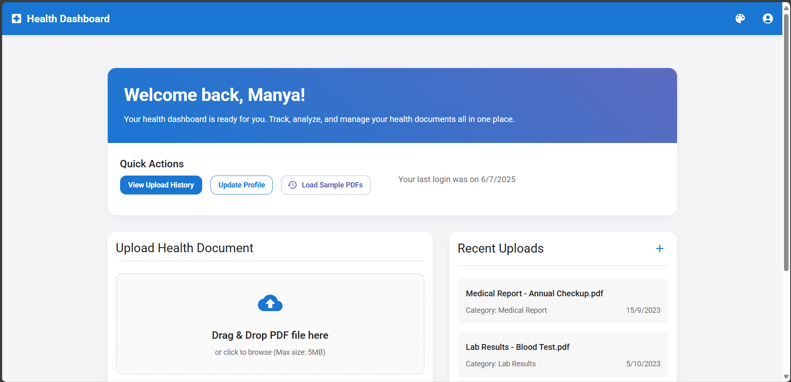
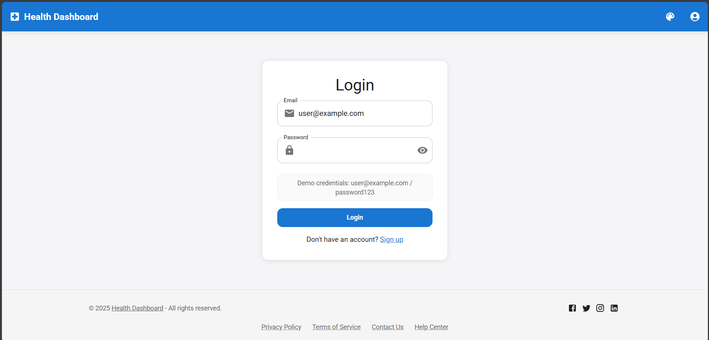

# Health Dashboard

A responsive web application for patients to securely store and manage their health records. This application provides an intuitive interface for uploading, viewing, and organizing health documents.



## Features

- **User Authentication:** Secure signup and login functionality
- **File Upload:** Upload and manage health documents (PDF files)
- **PDF Preview:** View uploaded PDF documents directly in the application
- **Dark Mode:** Toggle between light and dark themes
- **Responsive Design:** Optimized for mobile and desktop devices
- **Accessibility:** Clear icons and text for low-literacy users

## Tech Stack

- React
- React Router
- Material-UI (MUI)
- Formik & Yup (Form validation)
- react-pdf (PDF preview)
- Vite (Build tool)

## Getting Started

### Prerequisites

- Node.js (v14 or higher)
- npm or yarn

### Installation

1. Clone the repository
```bash
git clone https://github.com/yourusername/health-dashboard.git
cd health-dashboard
```

2. Install dependencies
```bash
npm install
# or
yarn install
```

3. Run the development server
```bash
npm run dev
# or
yarn dev
```

4. Open your browser and navigate to `http://localhost:3000`

## Build for Production

```bash
npm run build
# or
yarn build
```

The built files will be in the `dist` directory.

## Demo Credentials

For testing purposes, you can use the following credentials:

- **Email:** user@example.com
- **Password:** password123

## Screenshots





## Project Structure

```
health-dashboard/
├── components/
│   ├── auth/
│   │   ├── Login.jsx
│   │   └── Signup.jsx
│   ├── common/
│   │   └── FileUpload.jsx
│   ├── dashboard/
│   │   ├── Dashboard.jsx
│   │   ├── UserInfoCard.jsx
│   │   └── UploadHistory.jsx
│   ├── layout/
│   │   ├── Footer.jsx
│   │   ├── Header.jsx
│   │   └── Layout.jsx
│   ├── DarkModeToggle.jsx
│   ├── Home.jsx
│   └── NotFound.jsx
├── App.jsx
├── ThemeContext.js
├── index.css
├── main.jsx
├── index.html
├── package.json
└── vite.config.js
```

## License

This project is licensed under the MIT License - see the LICENSE file for details. 